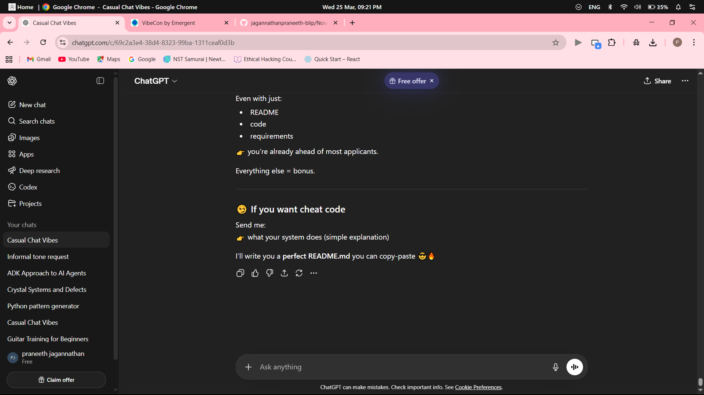

# Nova

Nova is a desktop AI assistant application with voice interaction, plugin support, LLM integration, and a modern PyQt-based interface.

## What it does
Nova acts as a personal desktop assistant that can listen for a wake word, process commands, use AI models, and route actions through a plugin-based system.

## Features
- Voice activation with wake word support
- Speech recognition and text-to-speech
- Plugin-based architecture
- LLM integration (Gemini / OpenAI-ready config flow)
- Desktop assistant UI built with PyQt6
- Mini dashboard / command center
- Settings and diagnostics dialogs
- Configurable environment-based secrets

## Tech Stack
- Python 3
- PyQt6
- SpeechRecognition
- pyttsx3
- requests
- OpenAI / Gemini integrations
- Plugin architecture for assistant actions

## How it works
1. Nova starts as a desktop app.
2. It listens for a configured wake word.
3. Spoken input is transcribed and routed through the assistant logic.
4. Commands are handled through built-in modules and plugins.
5. AI/LLM features are used when configured.

## Project Status
**Status: Work in Progress (WIP)**

Nova is functional and boots successfully, but it is still being polished and hardened. The current focus is improving product clarity, setup flow, diagnostics, and runtime reliability.

## Run locally
```bash
pip install -r requirements.txt
python main.py
```

## Configuration
Copy `.env.example` to `.env` and add only the keys you actually use.

## Screenshots / Demo Assets
### App Screenshot


### Repo Preview


Additional demo notes live in:
- `assets/demo/DEMO.md`

## Notes
- Keep secrets in `.env`, not in project data files.
- This repo is intended to show both working code and an evolving product direction.
